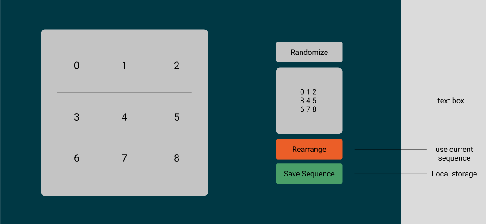
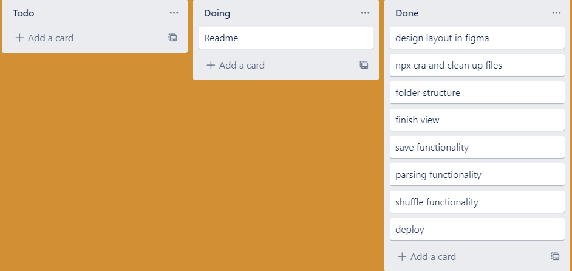

### Here's the deployed site: https://rearrange-challenge.vercel.app/

## How I solved the problem

- Here is where I parse the input string: https://github.com/galosandoval/rearrange-challenge/blob/main/src/utils/sequenceToString.js

- Here is the code I use to validate the input: https://github.com/galosandoval/rearrange-challenge/blob/main/src/utils/validateInput.js

- Here's where I persist the input data: https://github.com/galosandoval/rearrange-challenge/blob/main/src/utils/handleLocalStorage.js

- Some state management: https://github.com/galosandoval/rearrange-challenge/blob/main/src/components/Controls/Controls.jsx#L11

## How I worked on this project

- I planned out the layout using figma: 
- I worked while using a kanban board using trello: 
- Descriptive commits: https://github.com/galosandoval/rearrange-challenge/commits/main

## Available scripts

```
  npm start
```
